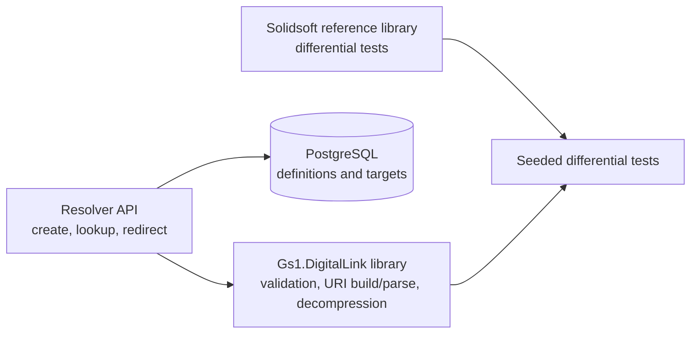

# GS1 Digital Link Toolkit

[](https://github.com/duruilhan/gs1-digital-link-toolkit/actions/workflows/ci.yml)

GS1 Digital Link connects GS1 identifiers, such as GTINs and GLNs, to web-accessible information and services. It allows standardized identifiers carried by barcodes to be used in digital applications without changing their meaning.

This .NET library provides the foundations for working with those identifiers. It calculates and validates GS1 check digits, identifies possible GS1 key types by length, loads Application Identifier (AI) definitions from a JSON catalog, validates AI values against their length, character-set, and check-digit rules, and parses both parenthesized and raw GS1 element strings into ordered AI/value pairs.

It also builds uncompressed Digital Link URLs and decodes the supported fully compressed Digital Link form into validated AI/value pairs. It is not a complete implementation of every GS1 AI, compression form, or association rule.

## Build and test

Requirements: [.NET 10 SDK](https://dotnet.microsoft.com/download/dotnet/10.0) and Git.

```bash
git clone https://github.com/duruilhan/gs1-digital-link-toolkit.git
cd gs1-digital-link-toolkit
dotnet restore
dotnet build --no-restore
dotnet test --no-build
```

Every push and pull request also runs the build and test suite through GitHub Actions.

## Fresh setup guide

This guide starts from a new Windows machine. It does not assume that PostgreSQL, a local NuGet cache, or a previous database already exists.

### 1. Install the prerequisites

Install:

- .NET 10 SDK
- Git
- PostgreSQL 16 or later

During PostgreSQL installation, keep the PostgreSQL server running locally and remember the password selected for the `postgres` user.

Verify the installations from PowerShell:

```powershell
dotnet --version
git --version
psql --version
```

### 2. Clone and verify the project

```powershell
git clone https://github.com/duruilhan/gs1-digital-link-toolkit.git
cd gs1-digital-link-toolkit

dotnet restore gs1-digital-link-toolkit.slnx
dotnet build gs1-digital-link-toolkit.slnx --no-restore
dotnet test gs1-digital-link-toolkit.slnx --no-build
```

The normal solution tests do not require PostgreSQL.

### 3. Create the PostgreSQL database

Open PostgreSQL's `psql` shell and connect using the `postgres` user.

Create the resolver database:

```sql
CREATE DATABASE gs1_resolver;
```

Exit `psql` with:

```text
\q
```

### 4. Set the database connection string

In the PowerShell session that will run the resolver:

```powershell
$env:GS1_RESOLVER_CONNECTION_STRING = "Host=localhost;Port=5432;Database=gs1_resolver;Username=postgres;Password=YOUR_PASSWORD"
```

Replace `YOUR_PASSWORD` with the password selected during PostgreSQL installation.

This environment variable applies only to the current PowerShell session. If a new PowerShell window is opened, set it again before running the migrator or API.

### 5. Apply the migration and seed data

```powershell
dotnet run --project Gs1.DigitalLink.Resolver.Migrator --configuration Release
```

A successful run applies the included EF Core migration and verifies the three seeded resolver definitions.

### 6. Start the resolver API

```powershell
dotnet run --project Gs1.DigitalLink.Resolver.Api
```

With the included launch profile, the API runs at:

```text
http://localhost:5084
```

The interactive Scalar API documentation is available at:

```text
http://localhost:5084/scalar/v1
```

The OpenAPI document is available at:

```text
http://localhost:5084/openapi/v1.json
```

### 7. Run the differential tests

`Gs1.DigitalLink.DifferentialTests` is intentionally separate from the normal solution test run because it compares this implementation with `Solidsoft.Reply.Gs1DigitalLinkLib`.

Restore it separately:

```powershell
dotnet restore Gs1.DigitalLink.DifferentialTests/Gs1.DigitalLink.DifferentialTests.csproj
```

Then run:

```powershell
dotnet test Gs1.DigitalLink.DifferentialTests/Gs1.DigitalLink.DifferentialTests.csproj --logger "console;verbosity=detailed"
```

The reference dependency comes from NuGet.org. If restore reports a certificate or TLS validation error, do not rely on a partially populated local NuGet cache. Verify that the machine can reach NuGet.org with a valid trusted certificate chain, including any required corporate proxy certificate, and then repeat the restore.

## Install and use

Build a local package with `dotnet pack Gs1.DigitalLink/Gs1.DigitalLink.csproj --configuration Release`. The resulting `.nupkg` file can be used as a local NuGet source, or the library can be referenced directly from the project.

```csharp
using Gs1.DigitalLink;

string uri = Gs1DigitalLinkBuilder.Build([
    new Gs1Element("01", "08690504080008"),
    new Gs1Element("10", "LOT123")
]);
// https://id.gs1.org/01/08690504080008/10/LOT123
```

## Architecture



The library is reusable without the resolver. The resolver API persists canonical Digital Link paths and targets in PostgreSQL, while the differential-test project compares library behavior with the reference implementation using reproducible generated inputs.

## Resolver data model

The resolver uses a hybrid relational model. `LinkDefinition.CanonicalPath` is the unique identity used for exact lookups, while ordered AI/value pairs are also stored in `LinkIdentifier` rows for identifier-based queries. Each definition can have multiple `LinkTarget` rows with a link type, destination URL, optional language and media type, and a default marker. Target uniqueness includes definition, link type, language, and media type so the same relation and language can intentionally expose both `text/html` and `application/json`. PostgreSQL normally treats null values as distinct in a unique index, so the target index explicitly uses `NULLS NOT DISTINCT`; this prevents duplicate targets when optional language or media-type values are null. A filtered unique index allows at most one default target per definition.

The PostgreSQL connection string is never stored in source control. Set it through the `GS1_RESOLVER_CONNECTION_STRING` environment variable before applying the included migration through `ResolverDatabase.MigrateAsync`. The initial migration seeds the three sample definitions and their targets.

Resolver repository and HTTP endpoint tests use EF Core's in-memory provider so the normal GitHub Actions workflow does not require a PostgreSQL service. InMemory verifies repository behavior, seed retrieval, application-level duplicate detection, and HTTP status contracts. It does not enforce PostgreSQL unique or filtered indexes. Those database rules are therefore checked against SQL generated from the EF Core migrations, while the generated migrations are applied to PostgreSQL during local integration verification.

## Resolver API

`Gs1.DigitalLink.Resolver.Api` exposes create, lookup, and delete endpoints under `/definitions`. Creation accepts AI/value elements rather than a caller-supplied path; `Gs1DigitalLinkBuilder` validates and canonically orders them before the path is stored. Data attributes such as AI 17 are accepted but remain query data and do not change definition identity.

Every other valid Digital Link path is resolved with an exact canonical-path lookup. A missing qualified definition returns `404`; the resolver does not silently fall back to a less-qualified record because qualifiers identify a different resource. An invalid path returns `400`.

Target selection applies the requested `linkType`, then `Accept-Language`, then the `Accept` media type. Header preferences and quality values are respected. A more specific requested language can match a more general target language (`tr-TR` can match `tr`), but a general request does not match a more specific target (`tr` does not match `tr-TR`). When an explicit `linkType` leaves several targets and no language or media preference is supplied, the requested type is still honored and a deterministic target is selected (a language-neutral target first, then language, media type, and URL in ordinal order). If a requested language or media preference cannot be satisfied, the definition's default target is used, even when that default has a different link type. With no preferences the default is used, or the sole target when a definition has exactly one. If selection is ambiguous and no default exists, the response is `406 Not Acceptable`. A selected target is returned as a `307 Temporary Redirect`.

Passing `linkType=all` returns the definition and all targets as JSON without redirecting. Redirect responses also advertise every available target in RFC 8288 `Link` fields using an absolute GS1 vocabulary relation URI plus optional `hreflang` and `type` parameters, for example `<https://example.com/tr/product>; rel="https://gs1.org/voc/pip"; hreflang="tr"; type="text/html"`.

The OpenAPI document is available at `/openapi/v1.json`, and the interactive Scalar UI is available at `/scalar/v1`.

## Design decisions

### Building a Digital Link

```csharp
using Gs1.DigitalLink;

string url = Gs1DigitalLinkBuilder.Build([
    new Gs1Element("01", "08690504080008"),
    new Gs1Element("10", "LOT123"),
    new Gs1Element("17", "261231")
]);
// https://id.gs1.org/01/08690504080008/10/LOT123?17=261231

string raw = "010869050408000810LOT123\u001D17261231";
string fromBarcode = Gs1DigitalLinkBuilder.Build(Gs1RawElementStringParser.Parse(raw));

IReadOnlyList<Gs1Element> elements = Gs1DigitalLinkParser.Parse(url);
bool parsed = Gs1DigitalLinkParser.TryParse(url, out var safeElements);
```

`Build` optionally accepts a custom absolute HTTP(S) base address, including a path prefix. Credentials, query strings and fragments are rejected in the base address. Invalid elements or combinations throw `ArgumentException`; a null element collection throws `ArgumentNullException`.

The JSON catalog records each AI's `role`. Qualifiers also specify `qualifierFor` and `qualifierOrder`. Exactly one primary key is required. GTIN qualifiers are emitted in the order **22, 10, 21**, regardless of input order; missing qualifiers are skipped. Data attributes are emitted in ordinal AI-code order in the query string for deterministic output. The original input collection is not modified.

Each value is encoded separately with `Uri.EscapeDataString`, so `A/B` becomes `A%2FB` and `50%` becomes `50%25`. The URL's structural separators are not encoded.

### Why a GTIN qualifier cannot accompany a GLN

For example, `414=8690123456789` with `10=LOT123` is rejected. AI 10 qualifies GTIN (01), not GLN (414). Moving it into the query string would silently change its catalog role; adding it to the path would imply an unsupported relationship. The same check applies to all catalog qualifiers and primary keys.

Duplicate AI codes are rejected by the builder, even when the values match, to avoid ambiguous URLs. This is deliberately stricter than the parsers, which preserve repeated elements from their input.

### Parsing a Digital Link

`Gs1DigitalLinkParser` provides `TryParse` for expected invalid input and `Parse` for callers that need a positional `Gs1ParseException`. It finds the first primary-key AI path segment, so deployment prefixes such as `https://example.com/dl/` are allowed. It decodes percent-encoded values and rejects unknown AIs, invalid values, misplaced data attributes, GTIN qualifiers used with another primary key, duplicates, and non-canonical qualifier order.

The exact property `Parse(Build(x)) == x` does not hold when `x` is in a non-canonical order: the builder intentionally reorders GTIN qualifiers and data attributes. The round-trip guarantees are instead:

- `Build(Parse(Build(x))) == Build(x)`
- `Parse(Build(x)) == Canonicalize(x)`

These properties are checked with 1,000 reproducible randomly generated valid element lists using a fixed seed. The generator deliberately varies both element presence and input order. Exact examples and invalid URLs remain as ordinary regression tests.

### Why validation returns `false`

`IsValid` methods return `false` for malformed input instead of throwing exceptions. Invalid barcode data is an expected validation result, especially when processing external input, so callers should not need `try`/`catch` for normal control flow.

### Why unknown AI codes return `false`

The validator accepts only Application Identifiers defined in the catalog. An unknown code has no trusted format or validation rules, so treating it as invalid avoids silently accepting data whose meaning is not known.

### Why the AI catalog is stored as JSON

Application Identifier definitions are data rather than validation logic. Keeping them in `Data/application-identifiers.json` separates the catalog from the code, makes definitions easier to review and extend, and allows the same validation implementation to work with additional AIs.
